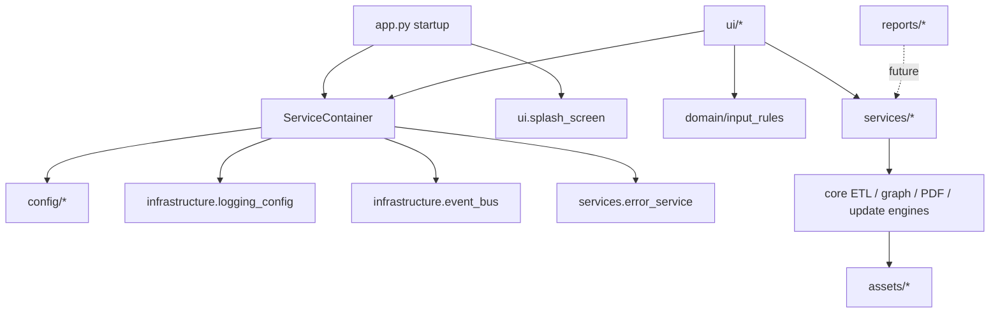
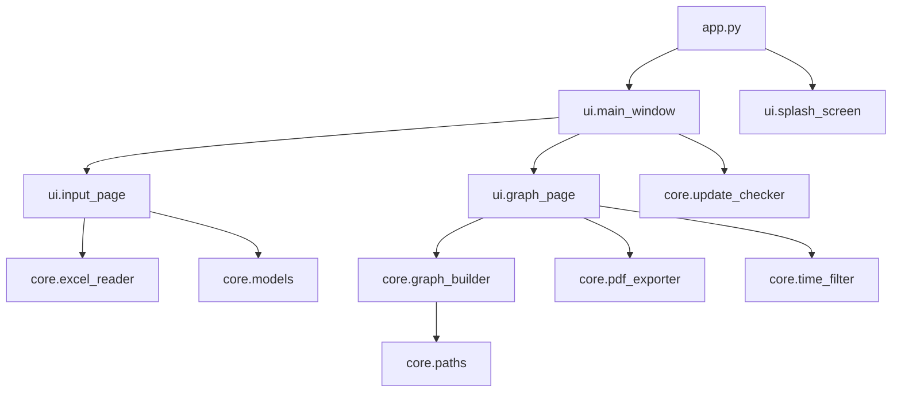
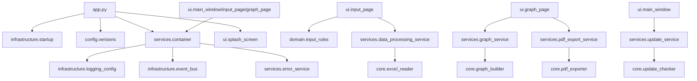

# MUG v1.5.0 Enterprise Foundation

## Architecture Diagram

## Dependency Graph Before

## Dependency Graph After

## Moved Modules

- Startup single-instance guard moved from `app.py` to `infrastructure/startup.py`.
- Version/path concerns moved from UI duplicates into `config/versions.py` and `config/paths.py`.
- Input form business validation moved from `ui/input_page.py` into `domain/input_rules.py`.
- ETL, graph, PDF and update calls now flow through service boundaries in `services/`.
- Asset lookup remains backward-compatible through `core/paths.py`, with canonical categorized locations under `assets/`.

## Migration Notes

- Existing `core` behavior modules remain in place for compatibility and test stability.
- UI classes now receive a service container and use service boundaries for business operations.
- Logging is centralized through Python `logging` with rotating files under the user-local MUG log directory.
- The event bus is synchronous and intentionally lightweight; it prepares for future UI/report decoupling without threading changes.
- `reports/` is scaffolded for v2.0.0 report engine work without changing current PDF export.

## Maintainability Improvements

- Single version/path implementation for runtime and PyInstaller.
- Service container enables dependency injection in tests and future report workflows.
- Error handling has a central service for exception logging and future diagnostics.
- Splash and startup behavior remain isolated from heavy imports.
- Future report engine packages exist without being coupled to the current UI.
